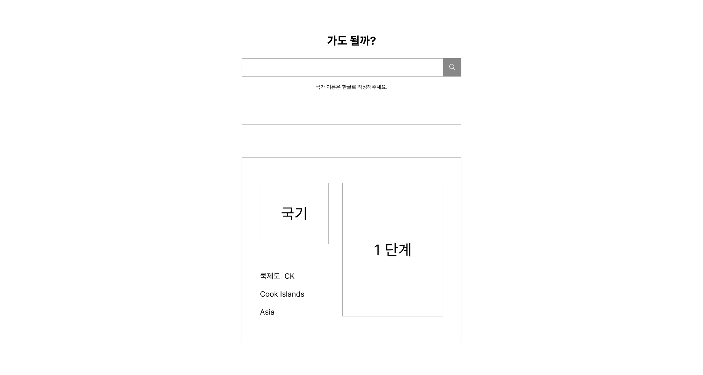

# 여행 경보 API

[공공데이터 포털의 국가∙지역별 여행경보](https://www.data.go.kr/tcs/dss/selectApiDataDetailView.do?publicDataPk=15076237) 데이터를 활용

 

# 구현된 모습

- 와이어프레임
    
    
    
- 개발 완료 화면 
    https://vanillajs-travel-alert-bowoo.netlify.app/

 
 

# Skill & Tools

- HTML
- CSS
- VANILLA JAVASCRIPT
- Rest

 
 

# 기능

1. 검색창에 국가 이름을 검색했을 때 해당 국가 여행경보 출력
    - 국가 이름은 한글로 검색
    - 여행 경보 : 1~4단계, null은 특별여행경보

 
 

# 이 프로젝트를 하는 목적

- 공공데이터을 받아와 출력하는 방법을 학습
- **REST API 활용** 경험을 쌓기위해
- 실제 사용자가 사용할 수 있는 웹 어플리케이션을 제작해보기 위해

 
 

# 어려웠던 점 & 해결방법

- cors error가 발생했을 때 처리 방법을 모름
    
    → 추후 팀 프로젝트로 실습하면서 공부할 예정
    
- api를 사용하여 서버에서 원하는 데이터를 받아오는 방법을 몰랐음
    
    → 파라미터에 여러 조건을 부여해서 원하는 데이터를 받아왔음. (?, &, = 을 사용)
 
 

# 리팩토링
- ISO 국가코드로 검색할 수 있는 기능 추가
- 다른 open API를 활용하여 각자 만든 기능을 하나의 어플리케이션으로 합치기
- axios 사용하여 API 활용. ⇒ fetch 와 차이점을 비교

 
 

# 회고

- 👻 **승원**
    - fetch를 이전에 딱 한번만 사용해봐서 이번에 써봤을 때 많이 낯설었다.
    - fetch의 응답값은 Promise로 받아지는데 Promise에 대한 개념이 많이 부족하다고 느꼈다. 더 공부하자!

- 🤡 **보우**
    - fetch에 대한 지식이 매우 부족. 서버와 호출하는 공부가 더 필요함.
    - Promise 정리 ([https://energetic-health-c10.notion.site/Promise-25bfa90b02a345bebad91b72c4f620f8](https://www.notion.so/Promise-25bfa90b02a345bebad91b72c4f620f8))
    - 
    
- 🙉 **찬민**
    - Promise 에 대한 이해도가 부족하였다. 전반적인 기능이나 개념에 대해서는 알고 있었지만, 
    직접 사용하는 내용을 디테일하게 정리해야할 필요가 있다.
    - API 를 사용하는 다양한 방법과 차이점에 대해 이해할 시간이 필요함.
